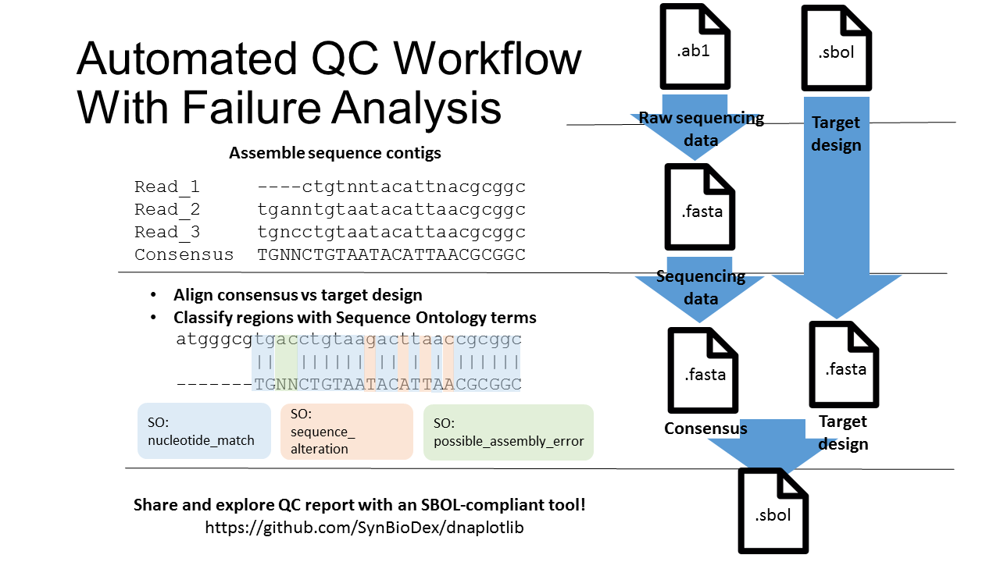
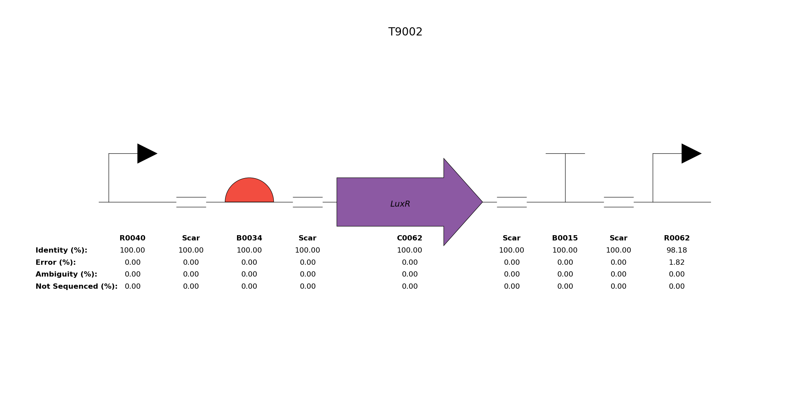

SBOL-QC
===========

SBOL-QC is a python package for automated sequence verification, screening, and failure analysis of genetic constructs for synthetic biology.   Methods in this package are used to verify an assembly clone against its target design and then generate a visual quality control (QC) report.  This package takes as its input multiple sequence reads and a target design in SBOL.  First the sequence reads are assembled into a contig from which a consensus call is made.  The consensus call is the best prediction for the actual sequence of the clone based on provided data.  Next this consensus sequence is aligned and verified against the target design sequence.  Finally the alignment is classified into annotated regions associated with a descriptive term for the mutation or assembly error type.  These QC annotations are saved as SBOL so that QC reports can be easily shared and visualized with software tools.

<a href="gallery/all_parts"></a>

The API methods in SBOL-QC calculate a variety of QC statistics that describe failure modes on a part by part basis.  These include alignment statistics, like percentage identity, error, ambiguity, and unsequenced.  They also include failure frequencies, the average size of mutations, and the average location of mutations, metrics which may be helpful for identifying regions that are genetically unstable or biologically interesting. 

AUTHORS
=======
SBOL-QC is under development by Bryan Bartley in the Systems & Synthetic Biology Lab (PI: Herbert Sauro) at the University of Washington.

DEPENDENCIES
============
SBOL-QC depends on the Clustal Omega[26] command-line tool (v.1.2.0) and the EMBOSS consensus tool (v6.5.0.0)

PLATFORMS
=========
Tested on Mac OSX Version 10.9.5 and Windows 7 Enterprise with Python 2.7.9 32 bit. Python 3 not currently supported.

INSTALLATION
============
Package installation requires setuptools, available here https://pypi.python.org/pypi/setuptools#downloads. (Setuptools is a stable and well-supported library that makes distributing Python projects easier)

1 - Git the package.

2 - After setuptools is installed, run the DNAPlotLib installer script using the following command line in the package's root directory :
```
$ python setup.py install
```
3 - Test import of the modules in your python environment.  (Caution!  If you are inside the package folder when you attempt import, the Python interpreter will try to load the module locally rather than from your system installation and will consequently fail.  Navigate outside the package folder and re-attempt import.)
```
>>> import sbol
>>> import sbolqc as qc
```

CODE EXAMPLE
============

```
```
EXAMPLE FIGURES
===============
Alignment statistics for % Identity, % Error, % Ambiguous, and % Unsequenced are correlated with each genetic part indicated by the SBOL Visual glyph.
###QC Report
<a href="gallery/all_parts"></a>
